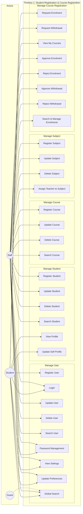

# 5.1.2 Use Case Diagram – Timebox 1: Manage Student Registration & Course Registration Process

## Use Case Diagram (Mermaid)

Renders in GitHub, GitLab, and many Markdown viewers.

**Note:** For a standard UML use-case style layout (actors on the left, use cases in a system boundary), use the PlantUML version below.

---

## Use Case Diagram (PlantUML)

Copy the code below into [PlantUML](https://www.plantuml.com/plantuml/uml) or use a VS Code PlantUML extension to generate the diagram.

```plantuml
@startuml Timebox1_UseCaseDiagram
left to right direction
skinparam packageStyle rectangle

actor "Student" as Student
actor "Staff" as Staff
actor "Guest" as Guest #LightGray

rectangle "University Academic Portal\n(Timebox 1)" {

  rectangle "Manage User" {
    usecase "Register User" as UC_RegisterUser
    usecase "Login" as UC_Login
    usecase "Update User" as UC_UpdateUser
    usecase "Delete User" as UC_DeleteUser
    usecase "Search User" as UC_SearchUser
    usecase "Password Management\n(Forgot / Reset / Update)" as UC_PasswordMgmt
    usecase "View Settings" as UC_ViewSettings
    usecase "Update Preferences" as UC_UpdatePreferences
    usecase "Global Search" as UC_GlobalSearch
  }

  rectangle "Manage Student" {
    usecase "Register Student" as UC_RegisterStudent
    usecase "Update Student" as UC_UpdateStudent
    usecase "Delete Student" as UC_DeleteStudent
    usecase "Search Student" as UC_SearchStudent
    usecase "View Profile\n(with GPA)" as UC_ViewProfile
    usecase "Update Self Profile\n(Phone, Address, Photo)" as UC_UpdateSelfProfile
  }

  rectangle "Manage Course" {
    usecase "Register Course" as UC_RegisterCourse
    usecase "Update Course" as UC_UpdateCourse
    usecase "Delete Course" as UC_DeleteCourse
    usecase "Search Course" as UC_SearchCourse
  }

  rectangle "Manage Subject" {
    usecase "Register Subject" as UC_RegisterSubject
    usecase "Update Subject" as UC_UpdateSubject
    usecase "Delete Subject" as UC_DeleteSubject
    usecase "Assign Teacher to Subject" as UC_AssignTeacher
  }

  rectangle "Manage Course Registration" {
    usecase "Request Enrolment" as UC_RequestEnrolment
    usecase "Request Withdrawal" as UC_RequestWithdrawal
    usecase "View My Courses" as UC_ViewMyCourses
    usecase "Approve Enrolment" as UC_ApproveEnrolment
    usecase "Reject Enrolment" as UC_RejectEnrolment
    usecase "Approve Withdrawal" as UC_ApproveWithdrawal
    usecase "Reject Withdrawal" as UC_RejectWithdrawal
    usecase "Search & Manage Enrolments" as UC_ManageEnrolments
  }
}

' Student
Student --> UC_RegisterUser
Student --> UC_Login
Student --> UC_PasswordMgmt
Student --> UC_ViewSettings
Student --> UC_UpdatePreferences
Student --> UC_GlobalSearch
Student --> UC_ViewProfile
Student --> UC_UpdateSelfProfile
Student --> UC_RequestEnrolment
Student --> UC_RequestWithdrawal
Student --> UC_ViewMyCourses

' Staff
Staff --> UC_Login
Staff --> UC_UpdateUser
Staff --> UC_DeleteUser
Staff --> UC_SearchUser
Staff --> UC_PasswordMgmt
Staff --> UC_ViewSettings
Staff --> UC_UpdatePreferences
Staff --> UC_GlobalSearch
Staff --> UC_RegisterStudent
Staff --> UC_UpdateStudent
Staff --> UC_DeleteStudent
Staff --> UC_SearchStudent
Staff --> UC_RegisterCourse
Staff --> UC_UpdateCourse
Staff --> UC_DeleteCourse
Staff --> UC_SearchCourse
Staff --> UC_RegisterSubject
Staff --> UC_UpdateSubject
Staff --> UC_DeleteSubject
Staff --> UC_AssignTeacher
Staff --> UC_ApproveEnrolment
Staff --> UC_RejectEnrolment
Staff --> UC_ApproveWithdrawal
Staff --> UC_RejectWithdrawal
Staff --> UC_ManageEnrolments

' Guest (optional)
Guest --> UC_GlobalSearch

@enduml
```

---

## Section A: Use Case Descriptions

**Timebox 1: Manage Student Registration & Course Registration Process**

| Use Case Name | Actor | Flow of Event |
|---------------|-------|----------------|
| Register User | Student | Enter the user details (name, email, password) in the registration form. Then, click the "Register" button to create the account. |
| Register Student | Staff | Enter the student details in the student's form. Then, click the "Register" or "Save" button to store the student records. |
| Register Course | Staff | Enter the course details (course code, title, credits, semester) in the course's form. Then, click the "Add Course" button to store the course records. |
| Register Subject | Staff | Enter the subject details in the subject's form. Then, click the "Add Subject" button to store the subject records. |
| Request Enrolment | Student | Select a course from the catalog. Then, click the "Request Enrolment" button to submit the enrolment request. |
| Approve Enrolment | Staff | Select a pending enrolment in the enrolments list. Then, click the "Approve" button to approve the enrolment. |

---

*Document for Chapter 5 – System Implementation, Timebox 1: Manage Student Registration & Course Registration Process.*
