# 5.1.2 Use Case Diagram – Timebox 1: Manage Student Registration & Course Registration Process

## Use Case Diagram (PlantUML)

Copy the code below into [PlantUML](https://www.plantuml.com/plantuml/uml) or use a VS Code PlantUML extension to generate the diagram. **For Microsoft Word:** export as PNG/SVG with the compact layout below (scale 1.0, reduced padding) so the image fits page height better; arrow colours match actors (see legend).

```plantuml
@startuml Timebox1_UseCaseDiagram
left to right direction
scale 1.0
skinparam dpi 300
skinparam packageStyle rectangle
skinparam shadowing false
skinparam ranksep 6
skinparam nodesep 5
skinparam RectanglePadding 4
skinparam defaultFontSize 9

actor "Guest" as Guest #LightGray
actor "Student" as Student #LightBlue
actor "Staff" as Staff #LightGreen

rectangle "University Academic Portal (Timebox 1: Student Registration & Course Registration)" #White {

  together {
    rectangle "Manage User" #AliceBlue {
      usecase "Register User" as UC_RegisterUser
      usecase "Login" as UC_Login
      usecase "Update User" as UC_UpdateUser
      usecase "Delete User" as UC_DeleteUser
      usecase "Search User" as UC_SearchUser
      usecase "Password Management" as UC_PasswordMgmt
      usecase "View Settings" as UC_ViewSettings
      usecase "Update Preferences" as UC_UpdatePreferences
      usecase "Global Search" as UC_GlobalSearch
    }
    rectangle "Manage Student" #MintCream {
      usecase "Register Student" as UC_RegisterStudent
      usecase "Update Student" as UC_UpdateStudent
      usecase "Delete Student" as UC_DeleteStudent
      usecase "Search Student" as UC_SearchStudent
      usecase "View Profile (with GPA)" as UC_ViewProfile
      usecase "Update Self Profile" as UC_UpdateSelfProfile
    }
    rectangle "Manage Course" #Honeydew {
      usecase "Register Course" as UC_RegisterCourse
      usecase "Update Course" as UC_UpdateCourse
      usecase "Delete Course" as UC_DeleteCourse
      usecase "Search Course" as UC_SearchCourse
    }
    rectangle "Manage Subject" #LavenderBlush {
      usecase "Register Subject" as UC_RegisterSubject
      usecase "Update Subject" as UC_UpdateSubject
      usecase "Delete Subject" as UC_DeleteSubject
      usecase "Assign Teacher to Subject" as UC_AssignTeacher
    }
    rectangle "Manage Course Registration" #Beige {
      usecase "Request Enrolment" as UC_RequestEnrolment
      usecase "Request Withdrawal" as UC_RequestWithdrawal
      usecase "View My Courses" as UC_ViewMyCourses
      usecase "Approve Enrolment" as UC_ApproveEnrolment
      usecase "Reject Enrolment" as UC_RejectEnrolment
      usecase "Approve Withdrawal" as UC_ApproveWithdrawal
      usecase "Reject Withdrawal" as UC_RejectWithdrawal
      usecase "Search & Manage Enrolments" as UC_ManageEnrolments
    }
  }
}

Guest -[#808080]-> UC_RegisterUser
Guest -[#808080]-> UC_Login
Guest -[#808080]-> UC_PasswordMgmt
Guest -[#808080]-> UC_GlobalSearch

Student -[#2563EB]-> UC_Login
Student -[#2563EB]-> UC_PasswordMgmt
Student -[#2563EB]-> UC_ViewSettings
Student -[#2563EB]-> UC_UpdatePreferences
Student -[#2563EB]-> UC_GlobalSearch
Student -[#2563EB]-> UC_ViewProfile
Student -[#2563EB]-> UC_UpdateSelfProfile
Student -[#2563EB]-> UC_RequestEnrolment
Student -[#2563EB]-> UC_RequestWithdrawal
Student -[#2563EB]-> UC_ViewMyCourses

Staff -[#16A34A]-> UC_Login
Staff -[#16A34A]-> UC_UpdateUser
Staff -[#16A34A]-> UC_DeleteUser
Staff -[#16A34A]-> UC_SearchUser
Staff -[#16A34A]-> UC_PasswordMgmt
Staff -[#16A34A]-> UC_ViewSettings
Staff -[#16A34A]-> UC_UpdatePreferences
Staff -[#16A34A]-> UC_GlobalSearch
Staff -[#16A34A]-> UC_RegisterStudent
Staff -[#16A34A]-> UC_UpdateStudent
Staff -[#16A34A]-> UC_DeleteStudent
Staff -[#16A34A]-> UC_SearchStudent
Staff -[#16A34A]-> UC_RegisterCourse
Staff -[#16A34A]-> UC_UpdateCourse
Staff -[#16A34A]-> UC_DeleteCourse
Staff -[#16A34A]-> UC_SearchCourse
Staff -[#16A34A]-> UC_RegisterSubject
Staff -[#16A34A]-> UC_UpdateSubject
Staff -[#16A34A]-> UC_DeleteSubject
Staff -[#16A34A]-> UC_AssignTeacher
Staff -[#16A34A]-> UC_ApproveEnrolment
Staff -[#16A34A]-> UC_RejectEnrolment
Staff -[#16A34A]-> UC_ApproveWithdrawal
Staff -[#16A34A]-> UC_RejectWithdrawal
Staff -[#16A34A]-> UC_ManageEnrolments

legend right
  |= Color |= Actor |
  | <#808080> | Guest |
  | <#2563EB> | Student |
  | <#16A34A> | Staff |
endlegend

@enduml
```

---

## Use Case Descriptions

### Manage User

| Use Case Name | Actor | Flow of Event |
|---------------|-------|---------------|
| **Register User** | Guest | Enter the user details (name, email, password, confirmation) in the registration form. Complete reCAPTCHA verification. Then, click the "Register" button to create the account. System validates fields, hashes password, assigns default Student role, and sends email verification. |
| **Login** | Guest, Student, Staff | Enter email and password in the login form. Complete reCAPTCHA verification. Click "Login" to authenticate. System verifies credentials, applies rate limiting (5 attempts per email+IP), and provides feedback for incorrect attempts. "Remember Me" keeps session persistent. |
| **Update User** | Staff | Select a user from the user list. Enter updated details (name, email, photo). Validate photo format (jpeg/jpg/png, max 2MB). Click "Update" to save changes. System ensures no email duplication. |
| **Delete User** | Staff | Select a user from the user list. Click "Delete". Confirm the deletion in the confirmation dialog. System cascades delete related records. |
| **Search User** | Staff | Enter search keyword (name, email, or role) in the search field. Use filter tabs (All, Students, Teachers, Staff). Click "Search". Results display in paginated format. |
| **Password Management** | Guest, Student, Staff | **Forgot Password:** Enter email, click "Send Reset Link". System sends reset email with token. **Reset Password:** Click link in email, enter new password and confirmation, click "Reset". **Update Password:** (Authenticated) Enter current password, new password, confirmation; click "Update". |
| **View Settings** | Student, Staff | Navigate to Settings. System displays current preferences (email_announcements, email_messages, email_notifications) with defaults. |
| **Update Preferences** | Student, Staff | Navigate to Settings. Toggle preference options (email_announcements, email_messages, email_notifications). Click "Save". System validates boolean values and stores in user record. |
| **Global Search** | Guest, Student, Staff | Enter search keyword (minimum 2 characters) in the global search bar. Click "Search". System returns results by type (courses, announcements, etc.) with title, subtitle, URL. Results limited per entity type. Role-based scope: Student (courses, assignments, announcements); Teacher (courses/subjects, assignments); Staff (students, users, courses, subjects, announcements); Guest (public courses, announcements). |

---

### Manage Student

| Use Case Name | Actor | Flow of Event |
|---------------|-------|---------------|
| **Register Student** | Staff | Link to existing User account with Student role. Enter student details (full name, email, phone, programme, intake_year, DOB, gender, status). Upload photo (jpeg/jpg/png, max 2MB) and documents (ID, Card, Transcript – pdf/jpeg/jpg/png, max 5MB). Click "Register" to store. System auto-generates Student Number (STU0001, STU0002) and validates all fields. |
| **Update Student** | Staff | Select a student from the list. Enter updated details. Replace photo/documents if needed. Click "Update" to save. System validates all fields, ensures no duplication of Student Number or Email. |
| **Delete Student** | Staff | Select a student from the list. Click "Delete". Confirm deletion in the dialog. System cascades delete enrolments and grades. |
| **Search Student** | Staff | Enter search keyword (Student Number, Name, Email, Programme). Apply filters (Programme, Intake Year, Status). Click "Search". Results display in paginated format (10 per page). |
| **View Profile (with GPA)** | Student | Navigate to My Profile. System displays student profile with calculated GPA. Student Number, Programme, Email, Name are read-only. |
| **Update Self Profile** | Student | Navigate to My Profile. Update phone number, address, or profile photo. Click "Save". System restricts editing of Student Number, Programme, Email, Name. |

---

### Manage Course

| Use Case Name | Actor | Flow of Event |
|---------------|-------|---------------|
| **Register Course** | Staff | Enter course details (course_code, title, credits, semester) in the course form. Upload course photo (jpeg/jpg/png, max 2MB). Click "Add Course" to store. System ensures course code uniqueness and validates credits (1–10). |
| **Update Course** | Staff | Select a course from the list. Enter updated details. Replace photo if needed. Click "Update" to save. System validates course code uniqueness excluding current record. |
| **Delete Course** | Staff | Select a course from the list. Click "Delete". Confirm deletion. System prevents deletion if course has enrolled students; returns error with enrolment count if applicable. |
| **Search Course** | Staff | Enter search keyword (Course Code, Title, Semester). Apply filters (Semester, Enrollment Status). Sort by Course Code, Title, Credits, or Semester. Results display in table format. |

---

### Manage Subject

| Use Case Name | Actor | Flow of Event |
|---------------|-------|---------------|
| **Register Subject** | Staff | Select course. Enter subject details (subject_code, title, credits). Upload photo (jpeg/jpg/png, max 2MB). Click "Add Subject" to store. System validates course exists, subject code uniqueness, credits (1–10). |
| **Update Subject** | Staff | Select a subject from the list. Enter updated details. Click "Update" to save. System validates subject code uniqueness. |
| **Delete Subject** | Staff | Select a subject from the list. Click "Delete". Confirm deletion in the dialog. |
| **Assign Teacher to Subject** | Staff | Select a subject. Choose one or more teachers from the list. Click "Assign". System validates teacher exists and has Teacher role. |

---

### Manage Course Registration

| Use Case Name | Actor | Flow of Event |
|---------------|-------|---------------|
| **Request Enrolment** | Student | Select a course from the catalog. Click "Request Enrolment". System validates student record, checks for duplicate enrolment or pending request, checks schedule conflicts, and creates enrolment with status *pending* using a database transaction. |
| **Request Withdrawal** | Student | Navigate to My Courses. Select an approved enrolment. Click "Request Withdrawal". System validates student is enrolled and changes status to *withdrawal_pending*. |
| **View My Courses** | Student | Navigate to My Courses. System displays approved and withdrawal_pending enrolments with course subjects, enrolment date, and status. Ordered by Course Code. |
| **Approve Enrolment** | Staff | Navigate to enrolments management. View pending enrolment requests. Select a pending enrolment. Click "Approve". System changes status from *pending* to *approved*. |
| **Reject Enrolment** | Staff | Navigate to enrolments management. Select a pending enrolment. Click "Reject". System changes status from *pending* to *rejected*. Student may re-apply after rejection. |
| **Approve Withdrawal** | Staff | Navigate to enrolments management. View pending withdrawal requests. Select a withdrawal_pending enrolment. Click "Approve Withdrawal". System deletes the enrolment record. |
| **Reject Withdrawal** | Staff | Navigate to enrolments management. Select a withdrawal_pending enrolment. Click "Reject Withdrawal". System reverts status from *withdrawal_pending* to *approved*. |
| **Search & Manage Enrolments** | Staff | Navigate to enrolments management. View pending enrolment and withdrawal requests. Search and filter enrolments. View details (course, student, request timestamp). Results display in table format. |

---

*Document for Chapter 5 – System Implementation, Timebox 1: Manage Student Registration & Course Registration Process.*
