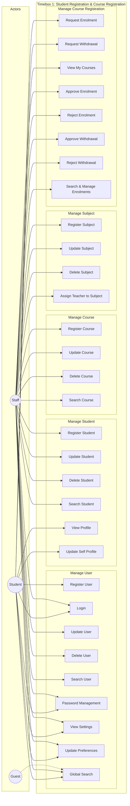

# 5.1.2 Use Case Diagram – Timebox 1: Manage Student Registration & Course Registration Process

## Use Case Diagram (Mermaid)

Renders in GitHub, GitLab, and many Markdown viewers.

**Note:** For a standard UML use-case style layout (actors on the left, use cases in a system boundary), use the PlantUML version below.

---

## Use Case Diagram (PlantUML)

Copy the code below into [PlantUML](https://www.plantuml.com/plantuml/uml) or use a VS Code PlantUML extension to generate the diagram.

```plantuml
@startuml Timebox1_UseCaseDiagram
left to right direction
skinparam packageStyle rectangle

actor "Student" as Student
actor "Staff" as Staff
actor "Guest" as Guest #LightGray

rectangle "University Academic Portal\n(Timebox 1)" {

  rectangle "Manage User" {
    usecase "Register User" as UC_RegisterUser
    usecase "Login" as UC_Login
    usecase "Update User" as UC_UpdateUser
    usecase "Delete User" as UC_DeleteUser
    usecase "Search User" as UC_SearchUser
    usecase "Password Management\n(Forgot / Reset / Update)" as UC_PasswordMgmt
    usecase "View Settings" as UC_ViewSettings
    usecase "Update Preferences" as UC_UpdatePreferences
    usecase "Global Search" as UC_GlobalSearch
  }

  rectangle "Manage Student" {
    usecase "Register Student" as UC_RegisterStudent
    usecase "Update Student" as UC_UpdateStudent
    usecase "Delete Student" as UC_DeleteStudent
    usecase "Search Student" as UC_SearchStudent
    usecase "View Profile\n(with GPA)" as UC_ViewProfile
    usecase "Update Self Profile\n(Phone, Address, Photo)" as UC_UpdateSelfProfile
  }

  rectangle "Manage Course" {
    usecase "Register Course" as UC_RegisterCourse
    usecase "Update Course" as UC_UpdateCourse
    usecase "Delete Course" as UC_DeleteCourse
    usecase "Search Course" as UC_SearchCourse
  }

  rectangle "Manage Subject" {
    usecase "Register Subject" as UC_RegisterSubject
    usecase "Update Subject" as UC_UpdateSubject
    usecase "Delete Subject" as UC_DeleteSubject
    usecase "Assign Teacher to Subject" as UC_AssignTeacher
  }

  rectangle "Manage Course Registration" {
    usecase "Request Enrolment" as UC_RequestEnrolment
    usecase "Request Withdrawal" as UC_RequestWithdrawal
    usecase "View My Courses" as UC_ViewMyCourses
    usecase "Approve Enrolment" as UC_ApproveEnrolment
    usecase "Reject Enrolment" as UC_RejectEnrolment
    usecase "Approve Withdrawal" as UC_ApproveWithdrawal
    usecase "Reject Withdrawal" as UC_RejectWithdrawal
    usecase "Search & Manage Enrolments" as UC_ManageEnrolments
  }
}

' Student
Student --> UC_RegisterUser
Student --> UC_Login
Student --> UC_PasswordMgmt
Student --> UC_ViewSettings
Student --> UC_UpdatePreferences
Student --> UC_GlobalSearch
Student --> UC_ViewProfile
Student --> UC_UpdateSelfProfile
Student --> UC_RequestEnrolment
Student --> UC_RequestWithdrawal
Student --> UC_ViewMyCourses

' Staff
Staff --> UC_Login
Staff --> UC_UpdateUser
Staff --> UC_DeleteUser
Staff --> UC_SearchUser
Staff --> UC_PasswordMgmt
Staff --> UC_ViewSettings
Staff --> UC_UpdatePreferences
Staff --> UC_GlobalSearch
Staff --> UC_RegisterStudent
Staff --> UC_UpdateStudent
Staff --> UC_DeleteStudent
Staff --> UC_SearchStudent
Staff --> UC_RegisterCourse
Staff --> UC_UpdateCourse
Staff --> UC_DeleteCourse
Staff --> UC_SearchCourse
Staff --> UC_RegisterSubject
Staff --> UC_UpdateSubject
Staff --> UC_DeleteSubject
Staff --> UC_AssignTeacher
Staff --> UC_ApproveEnrolment
Staff --> UC_RejectEnrolment
Staff --> UC_ApproveWithdrawal
Staff --> UC_RejectWithdrawal
Staff --> UC_ManageEnrolments

' Guest (optional)
Guest --> UC_GlobalSearch

@enduml
```

---

## Use Case Descriptions

### Manage User

| Use Case Name    | Actor   | Flow of Event |
|------------------|--------|----------------|
| Register User    | Student | Enter name, email, password, and password confirmation in the registration form. Accept terms. Complete reCAPTCHA. Click "Register" to create an account. System validates fields, hashes password, assigns default role Student, sends email verification, and logs the user in. |
| Login            | Student, Staff | Enter email and password (and optionally select "Remember Me"). Complete reCAPTCHA if configured. Click "Login". System verifies credentials, applies rate limiting (5 attempts per email+IP), and creates a session. Incorrect attempts receive feedback. |
| Update User      | Staff   | Select a user from the user list. Edit name, email, or photo (jpeg/jpg/png, max 2MB). Click "Update". System validates updates, ensures no duplicate email, and saves the record. |
| Delete User      | Staff   | Select a user and choose "Delete". Confirm deletion. System cascades delete to related records and removes the user. |
| Search User      | Staff   | Enter keyword in the search field and/or select a role tab (All, Students, Teachers, Staff). System returns matching users in paginated format. |
| Password Management | Student, Staff | **Forgot:** Enter email and submit; system sends a reset link. **Reset:** Open link from email, enter new password and confirmation, submit. **Update:** In profile, enter current password, new password and confirmation, then submit. System validates token (for reset) or current password (for update) and updates the password. |
| View Settings    | Student, Staff | Open the Settings page. System displays current preferences (email_announcements, email_messages, email_notifications) with defaults. |
| Update Preferences | Student, Staff | On the Settings page, toggle email_announcements, email_messages, and/or email_notifications. Click "Save preferences". System validates boolean values and stores them in the user record (JSON) merged with defaults. |
| Global Search    | Student, Staff, Guest | Enter at least 2 characters in the global search box. System returns results by role (type, title, subtitle, URL), limited per entity type (e.g. 5 per type). Student: courses, assignments, announcements; Staff: students, users, courses, subjects, announcements; Guest: public courses, visible announcements. |

---

### Manage Student

| Use Case Name       | Actor | Flow of Event |
|---------------------|-------|----------------|
| Register Student    | Staff | Select an existing User with Student role. Enter full name, email, phone, programme, intake year, DOB, gender, status. Upload photo (jpeg/jpg/png, max 2MB) and optionally ID/Transcript (pdf/image, max 5MB). Click "Register" or "Save". System auto-generates Student Number (STU0001, STU0002…), validates all fields and file types, and stores the student and files. |
| Update Student      | Staff | Select a student from the list and choose "Edit". Modify allowed fields and/or replace photo/documents. Click "Update". System validates updates, ensures no duplicate student number or email, and saves. |
| Delete Student      | Staff | Select a student and choose "Delete". Confirm deletion. System cascades delete to enrolments and grades, then removes the student. |
| Search Student      | Staff | Enter search terms (student number, name, email, programme) and/or set filters (Programme, Intake Year, Status). System returns results in paginated format (10 per page). |
| View Profile (with GPA) | Student | Open "My Profile". System displays student details and calculated GPA from approved grades. |
| Update Self Profile  | Student | On My Profile, update phone number, address, and/or profile photo. Cannot edit student number, programme, email, or name. Click "Save". System validates and stores the changes. |

---

### Manage Course

| Use Case Name  | Actor | Flow of Event |
|----------------|-------|----------------|
| Register Course | Staff | Enter course code, title, credits (1–10), semester. Optionally upload course photo (jpeg/jpg/png, max 2MB). Click "Add" or "Save". System checks required fields, ensures course code is unique, and stores the course and photo. |
| Update Course   | Staff | Select a course and choose "Edit". Modify course code, title, credits, semester, or photo. Click "Update". System validates and ensures course code uniqueness excluding the current record. |
| Delete Course   | Staff | Select a course and choose "Delete". Confirm. If the course has enrolled students, system prevents deletion and shows an error with enrolment count; otherwise the course is deleted. |
| Search Course   | Staff | Enter search terms (course code, title, semester) and/or filter by semester and enrollment status. Sort by course code, title, credits, or semester. System shows results in table format. |

---

### Manage Subject

| Use Case Name          | Actor | Flow of Event |
|------------------------|-------|----------------|
| Register Subject       | Staff | Select a course, enter subject code and title, set credits (1–10). Optionally upload photo (jpeg/jpg/png, max 2MB). Click "Add" or "Save". System validates course exists and subject code is unique, then stores the subject. |
| Update Subject         | Staff | Select a subject and choose "Edit". Modify subject code, title, credits, or photo. Click "Update". System validates and ensures subject code uniqueness. |
| Delete Subject         | Staff | Select a subject and choose "Delete". Confirm deletion. System deletes the subject. |
| Assign Teacher to Subject | Staff | Open the subject’s "Assign Teachers" page. Select one or more teachers (users with teacher role). Click "Update". System validates teachers and saves the assignments. |

---

### Manage Course Registration

| Use Case Name             | Actor | Flow of Event |
|---------------------------|-------|----------------|
| Request Enrolment         | Student | From the course catalog, select a course and click "Request Enrolment". System checks student record, no duplicate/pending enrolment, no withdrawal pending; checks schedule conflicts with enrolled courses; creates enrolment with status *pending* inside a database transaction. |
| Request Withdrawal        | Student | From "My Courses", select an approved enrolment and choose "Request Withdrawal". System verifies enrolment is approved and not already withdrawal_pending, then sets status to *withdrawal_pending*. |
| View My Courses           | Student | Open "My Courses". System lists only approved and withdrawal_pending enrolments with course subjects, enrollment date and status, ordered by course code. |
| Approve Enrolment         | Staff | Open enrolments management. Select a pending enrolment and choose "Approve". System validates enrolment is pending and changes status to *approved*. |
| Reject Enrolment          | Staff | Open enrolments management. Select a pending enrolment and choose "Reject". System validates enrolment is pending and changes status to *rejected* (student may re-apply later). |
| Approve Withdrawal        | Staff | Open enrolments management. Select an enrolment with withdrawal_pending and choose "Approve Withdrawal". System deletes the enrolment record. |
| Reject Withdrawal         | Staff | Open enrolments management. Select an enrolment with withdrawal_pending and choose "Reject Withdrawal". System reverts status from *withdrawal_pending* to *approved*. |
| Search & Manage Enrolments | Staff | Open the enrolments page. View pending enrolment requests and pending withdrawal requests. See course, student, and request timestamp. Use search/filters as needed. Results are shown in table format. |

---

*Document for Chapter 5 – System Implementation, Timebox 1: Manage Student Registration & Course Registration Process.*
