# 5.2.2 Use Case Diagram – Timebox 2: Manage Grades, Fee Payment & Assignment Process

## Use Case Diagram (PlantUML)

Copy the code below into [PlantUML](https://www.plantuml.com/plantuml/uml) or use a VS Code PlantUML extension to generate the diagram.

```plantuml
@startuml Timebox2_UseCaseDiagram
left to right direction
skinparam packageStyle rectangle

actor "Student" as Student
actor "Teacher" as Teacher
actor "Staff" as Staff

rectangle "University Academic Portal\n(Timebox 2)" {

  rectangle "Manage Grade" {
    usecase "Record Grade" as UC_RecordGrade
    usecase "Approve Grade" as UC_ApproveGrade
    usecase "Reject Grade" as UC_RejectGrade
    usecase "View Grade" as UC_ViewGrade
    usecase "Search Grade" as UC_SearchGrade
  }

  rectangle "Manage Fee" {
    usecase "Register Fee" as UC_RegisterFee
    usecase "Update Fee" as UC_UpdateFee
    usecase "Delete Fee" as UC_DeleteFee
    usecase "Search Fee" as UC_SearchFee
    usecase "View Fee" as UC_ViewFee
    usecase "Track Late Payment" as UC_TrackLatePayment
  }

  rectangle "Manage Payment" {
    usecase "Submit Payment Confirmation" as UC_SubmitPayment
    usecase "Approve Payment" as UC_ApprovePayment
    usecase "Reject Payment" as UC_RejectPayment
    usecase "Process Stripe Payment" as UC_StripePayment
    usecase "Generate Receipt" as UC_GenerateReceipt
  }

  rectangle "Manage Assignment" {
    usecase "Create Assignment" as UC_CreateAssignment
    usecase "Update Assignment" as UC_UpdateAssignment
    usecase "Delete Assignment" as UC_DeleteAssignment
    usecase "Publish Assignment" as UC_PublishAssignment
    usecase "View Assignments" as UC_ViewAssignments
    usecase "View Submissions" as UC_ViewSubmissions
    usecase "Grade Submission" as UC_GradeSubmission
    usecase "Download Submission" as UC_DownloadSubmission
    usecase "View Assignment Detail" as UC_ViewAssignmentDetail
    usecase "Submit Assignment" as UC_SubmitAssignment
    usecase "Download Own Submission" as UC_DownloadOwnSubmission
  }
}

Student --> UC_ViewGrade
Student --> UC_SearchGrade
Student --> UC_ViewFee
Student --> UC_SubmitPayment
Student --> UC_StripePayment
Student --> UC_ViewAssignments
Student --> UC_ViewAssignmentDetail
Student --> UC_SubmitAssignment
Student --> UC_DownloadOwnSubmission

Teacher --> UC_RecordGrade
Teacher --> UC_ViewGrade
Teacher --> UC_SearchGrade
Teacher --> UC_CreateAssignment
Teacher --> UC_UpdateAssignment
Teacher --> UC_DeleteAssignment
Teacher --> UC_PublishAssignment
Teacher --> UC_ViewAssignments
Teacher --> UC_ViewSubmissions
Teacher --> UC_GradeSubmission
Teacher --> UC_DownloadSubmission

Staff --> UC_ApproveGrade
Staff --> UC_RejectGrade
Staff --> UC_SearchGrade
Staff --> UC_RegisterFee
Staff --> UC_UpdateFee
Staff --> UC_DeleteFee
Staff --> UC_SearchFee
Staff --> UC_TrackLatePayment
Staff --> UC_ApprovePayment
Staff --> UC_RejectPayment
Staff --> UC_GenerateReceipt

@enduml
```

---

## Use Case Descriptions

### Manage Grade

| Use Case Name | Actor | Flow of Event |
|---------------|-------|----------------|
| Record Grade | Teacher | Select a subject assigned to the teacher. For each enrolled student, enter a score (0–100) or leave empty. Click "Submit Grades". System validates teacher is assigned to the subject, students are enrolled in the subject’s course, scores are numeric 0–100, uses updateOrCreate for idempotent save, sets status to *pending*, creates a review log entry (submitted), and notifies all staff via GradeReviewRequested. |
| Approve Grade | Staff | Open the grades review list. Select a pending grade and choose "Approve". System validates the grade exists and is pending, updates status to *approved*, sets reviewed_by and reviewed_at, clears rejection_reason, creates a review log entry (approved), and notifies the student via GradePublished. |
| Reject Grade | Staff | Open the grades review list. Select a pending grade, enter rejection reason (max 255 chars), and choose "Reject". System validates the grade is pending, sets status to *rejected*, sets reviewed_by, reviewed_at, and rejection_reason, creates a review log entry (rejected), and saves. |
| View Grade | Student | Open "My Grades". System shows only approved grades grouped by course and subject, with course code/title/credits/semester, subject code/title, score, overall GPA, and total count of approved grades. |
| View Grade | Teacher | Open the Grades section. System lists subjects assigned to the teacher, shows students and existing grades per subject, and displays graded/ungraded count, average, highest, lowest, with color-coded letter grades (A–F). |
| Search Grade | Student | On the grades page, enter course/subject code or title and/or filter by semester. Optionally toggle to show only subjects with grades. System displays matching grades and summary (average, highest, lowest). |
| Search Grade | Teacher | Search by subject/course code or title, filter by course, or search students by name or student number. System returns matching grade data. |
| Search Grade | Staff | Open the grades review page. System lists subjects with pending grades and pending count. Staff can search by subject/course or student name/number. System shows student info, score, grader, submission time, reviewer, review time, and rejection reason. |

---

### Manage Fee

| Use Case Name | Actor | Flow of Event |
|---------------|-------|----------------|
| Register Fee | Staff | Select a student. Enter amount, description (max 255 chars), and due date. Click "Add Fee" or "Save". System validates student exists and fields (amount 0–999999.99, due date), sets status to *pending*, and notifies the student via FeeStatusUpdated. |
| Update Fee | Staff | Select a fee and choose "Edit". Modify amount, description, due date, and/or status (pending, payment_pending, paid). If status is set to paid, enter or auto-set paid date. Click "Update". System validates, auto-sets or clears paid date as needed, and notifies the student if status changed. |
| Delete Fee | Staff | Select a fee and choose "Delete". Confirm. System performs cascade delete and removes the fee. |
| Search Fee | Staff | Enter search terms (description, amount, student name/number) and/or filter by status (all, pending, payment_pending, paid). System returns paginated results with statistics (total fees, paid amount, pending amount) and counts by status. |
| View Fee | Student | Open "My Fees". System shows only the student’s fees ordered by due date (desc), with amount, description, status, due date, paid date. Student can search, filter by status, view statistics (total, paid, pending, overdue count), toggle Cards/Table view, and see overdue fees highlighted. |
| Track Late Payment | Staff | Open the Fee management page. System identifies fees with status *pending* and due_date &lt; today, calculates days overdue, and displays them in a separate "Late Payments" section. |

---

### Manage Payment

| Use Case Name | Actor | Flow of Event |
|---------------|-------|----------------|
| Submit Payment Confirmation | Student | On "My Fees", select an unpaid fee and choose "Submit Payment Confirmation" (e.g. for bank transfer). Confirm. System validates the fee belongs to the student, is not paid, and has no pending confirmation; sets status to *payment_pending* for staff approval. |
| Approve Payment | Staff | Open fee management. Select a fee with status *payment_pending* and choose "Approve Payment". System validates status, sets status to *paid* and paid date to today, and notifies the student via FeeStatusUpdated. |
| Reject Payment | Staff | Select a fee with status *payment_pending* and choose "Reject Payment". System sets status back to *pending*, clears paid date, and notifies the student via FeeStatusUpdated. |
| Process Stripe Payment | Student | On "My Fees", select an unpaid fee and choose "Pay with Stripe". System validates ownership and that the fee is not paid, creates a Stripe Checkout Session, sets fee status to *payment_pending*, stores payment_intent_id, and redirects to Stripe. On success or cancel, system redirects back and handles the result. |
| Generate Receipt | Staff | Open a paid fee and choose "Generate Receipt". System validates the fee is paid, generates a PDF (DomPDF) with receipt number REC-{fee_id 6 digits}, date/time, student info (student_no, name, email, programme), fee details (description, due_date, paid_date, amount), PAID badge, and downloads as receipt-{student_no}-{fee_id}.pdf. |

*Note: Handle Stripe Webhook is a system use case (no user actor): on checkout.session.completed and payment_intent.succeeded the system updates the fee to paid, sets payment_method and payment_processed_at, and notifies the student; on payment_intent.payment_failed it reverts to pending.*

---

### Manage Assignment

| Use Case Name | Actor | Flow of Event |
|---------------|-------|----------------|
| Create Assignment | Teacher | Select a subject assigned to the teacher. Enter title (required), optional description, due date (required), optional due time, max score (1–1000), status (draft/published/closed), optional allowed file types (e.g. pdf, doc, docx), optional max file size (KB). Click "Create". System validates and stores the assignment linked to subject and course, with created_by set to current user. |
| Update Assignment | Teacher | Select an assignment owned by the teacher and choose "Edit". Modify fields (same validations as Create). Click "Update". System validates ownership and updates the assignment. |
| Delete Assignment | Teacher | Select an assignment owned by the teacher and choose "Delete". Confirm. System cascades delete to submission records and stored files. |
| Publish Assignment | Teacher | Select a draft assignment owned by the teacher and choose "Publish". System sets status to *published* so students can view and submit. |
| View Assignments | Teacher | Open the Assignments section. System lists subjects assigned to the teacher and shows assignments per subject with due date, status, submission count, graded count, ordered by due date. |
| View Submissions | Teacher | Open an assignment and choose "Submissions". System lists submissions with student info, file, comments, score, feedback, status, submitted_at, graded_at. |
| Grade Submission | Teacher | On the submissions list, select a submission and enter score (0 to assignment max_score) and optional feedback (max 5000 chars). Click "Grade". System sets graded_by, graded_at, and submission status to *graded*. |
| Download Submission | Teacher | On the submissions list, select a submission and choose "Download". System allows download of the student’s submitted file. |
| View Assignments | Student | Open "My Assignments". System shows only published assignments for enrolled courses (approved or withdrawal_pending), with subject and course details, submission status, and score/feedback if graded, ordered by due date. |
| View Assignment Detail | Student | Open an assignment. System verifies it is published and the student is enrolled in the assignment’s course, then displays assignment details and any existing submission. |
| Submit Assignment | Student | On the assignment detail page, upload a file (required) and optionally add comments (max 2000 chars). Click "Submit". System validates enrolment, assignment is published and not overdue, file type and size against assignment rules, stores the file, and creates or updates the single submission per student (on resubmission replaces file and resets grading fields). |
| Download Own Submission | Student | On the assignment or submissions page, choose "Download" for own submission. System validates ownership and allows download of the submitted file. |

---

*Document for Chapter 5 – System Implementation, Timebox 2: Manage Grades, Fee Payment & Assignment Process.*
