# 5.2.2 Use Case Diagram – Timebox 2: Manage Grades, Fee Payment & Assignment Process

## Use Case Diagram (PlantUML)

Copy the code below into [PlantUML](https://www.plantuml.com/plantuml/uml) or use a VS Code PlantUML extension to generate the diagram.

```plantuml
@startuml Timebox2_UseCaseDiagram
left to right direction
skinparam packageStyle rectangle

actor "Student" as Student
actor "Teacher" as Teacher
actor "Staff" as Staff

rectangle "University Academic Portal\n(Timebox 2)" {

  rectangle "Manage Grade" {
    usecase "Record Grade" as UC_RecordGrade
    usecase "Approve Grade" as UC_ApproveGrade
    usecase "Reject Grade" as UC_RejectGrade
    usecase "View Grade" as UC_ViewGrade
    usecase "Search Grade" as UC_SearchGrade
    usecase "Calculate Computed Grade" as UC_CalculateComputedGrade
    usecase "Submit Final Grade" as UC_SubmitFinalGrade
  }

  rectangle "Manage Fee" {
    usecase "Register Fee" as UC_RegisterFee
    usecase "Update Fee" as UC_UpdateFee
    usecase "Delete Fee" as UC_DeleteFee
    usecase "Search Fee" as UC_SearchFee
    usecase "View Fee" as UC_ViewFee
    usecase "Track Late Payment" as UC_TrackLatePayment
  }

  rectangle "Manage Payment" {
    usecase "Submit Payment Confirmation" as UC_SubmitPayment
    usecase "Approve Payment" as UC_ApprovePayment
    usecase "Reject Payment" as UC_RejectPayment
    usecase "Process Stripe Payment" as UC_StripePayment
    usecase "Generate Receipt" as UC_GenerateReceipt
  }

  rectangle "Manage Assignment" {
    usecase "Create Assignment" as UC_CreateAssignment
    usecase "Update Assignment" as UC_UpdateAssignment
    usecase "Delete Assignment" as UC_DeleteAssignment
    usecase "Publish Assignment" as UC_PublishAssignment
    usecase "View Assignments" as UC_ViewAssignments
    usecase "View Submissions" as UC_ViewSubmissions
    usecase "Grade Submission" as UC_GradeSubmission
    usecase "Download Submission" as UC_DownloadSubmission
    usecase "View Assignment Detail" as UC_ViewAssignmentDetail
    usecase "Submit Assignment" as UC_SubmitAssignment
    usecase "Download Own Submission" as UC_DownloadOwnSubmission
  }
}

Student --> UC_ViewGrade
Student --> UC_SearchGrade
Student --> UC_CalculateComputedGrade
Student --> UC_ViewFee
Student --> UC_SubmitPayment
Student --> UC_StripePayment
Student --> UC_ViewAssignments
Student --> UC_ViewAssignmentDetail
Student --> UC_SubmitAssignment
Student --> UC_DownloadOwnSubmission

Teacher --> UC_RecordGrade
Teacher --> UC_ViewGrade
Teacher --> UC_SearchGrade
Teacher --> UC_CalculateComputedGrade
Teacher --> UC_SubmitFinalGrade
Teacher --> UC_CreateAssignment
Teacher --> UC_UpdateAssignment
Teacher --> UC_DeleteAssignment
Teacher --> UC_PublishAssignment
Teacher --> UC_ViewAssignments
Teacher --> UC_ViewSubmissions
Teacher --> UC_GradeSubmission
Teacher --> UC_DownloadSubmission

Staff --> UC_ApproveGrade
Staff --> UC_RejectGrade
Staff --> UC_SearchGrade
Staff --> UC_RegisterFee
Staff --> UC_UpdateFee
Staff --> UC_DeleteFee
Staff --> UC_SearchFee
Staff --> UC_TrackLatePayment
Staff --> UC_ApprovePayment
Staff --> UC_RejectPayment
Staff --> UC_GenerateReceipt

@enduml
```

---

## Section A: Use Case Descriptions

**Timebox 2: Manage Grades, Fee Payment & Assignment Process**

| Use Case Name | Actor | Flow of Event |
|---------------|-------|----------------|
| Record Grade | Teacher | Enter the grades for each enrolled student in the grade entry form. Then, click the "Submit Grades" button to store the grade records. |
| Approve Grade | Staff | Select a pending grade in the grades review list. Then, click the "Approve" button to approve the grade. |
| Calculate Computed Grade | Teacher, Student | System automatically calculates a suggested subject grade by retrieving all graded assignment submissions for the subject, converting each assignment score to a percentage (score/max_score * 100), and calculating the average of all percentages. The computed grade is displayed alongside the final approved grade in the grade view. |
| Submit Final Grade | Teacher | Teacher views the grade management page showing computed grades from assignments. Teacher can either use the computed grade or enter a manual score. Teacher clicks "Submit Final Grade" button, which creates or updates a Grade record with status 'pending' and triggers the approval workflow. |
| Register Fee | Staff | Enter the fee details (amount, description, due date) in the fee form. Then, click the "Add Fee" button to store the fee records. |
| Submit Payment Confirmation | Student | Select an unpaid fee in My Fees. Then, click the "Submit Payment Confirmation" button to submit the payment for staff approval. |
| Process Stripe Payment | Student | Select an unpaid fee in My Fees. Then, click the "Pay with Stripe" button to complete the payment online. |
| Generate Receipt | Staff | Select a paid fee. Then, click the "Generate Receipt" button to download the PDF receipt. |
| Create Assignment | Teacher | Enter the assignment details (title, due date, max score, etc.) in the assignment form. Then, click the "Create" button to store the assignment records. |
| Submit Assignment | Student | Upload the assignment file in the assignment detail page. Then, click the "Submit" button to store the submission. |

---

*Document for Chapter 5 – System Implementation, Timebox 2: Manage Grades, Fee Payment & Assignment Process.*
