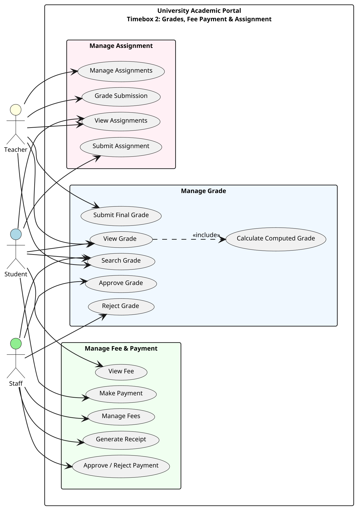

# 5.2.2 Use Case Diagram – Timebox 2: Manage Grades, Fee Payment & Assignment Process

## Use Case Diagram (PlantUML)

Copy the code below into [PlantUML](https://www.plantuml.com/plantuml/uml) or use a VS Code PlantUML extension to generate the diagram.

---

## Use Case Descriptions

*Consolidated core processes (View, Update, Delete, Search grouped as "Manage X") to align with Timebox 1 style.*

| Use Case Name | Actor | Flow of Event |
|---------------|-------|---------------|
| **Submit Assignment** | Student | Student uploads a file and optional comments for a published assignment. The system validates enrolment, file type/size, and that the assignment is open. One submission per student per assignment; resubmission replaces the file and resets grading. |
| **View Assignments** | Student / Teacher | Student sees published assignments for enrolled courses with submission status and score if graded. Teacher sees assignments per assigned subject with due date, status, and submission count. |
| **Manage Assignments** | Teacher | Teacher creates, updates, deletes, and publishes assignments; views submissions for grading. Covers Create Assignment, Update Assignment, Delete Assignment, Publish Assignment, and View Submissions. |
| **Grade Submission** | Teacher | Teacher enters score and optional feedback for a submission. The system validates score range and assignment ownership, sets graded_by and graded_at. Assignment scores contribute to the computed subject grade. |
| **View Grade** | Student / Teacher | Student views approved grades grouped by course and subject, with GPA and assignment breakdown. Teacher views grades with review status. Viewing includes calculating and displaying the computed grade from assignments. |
| **Submit Final Grade** | Teacher | Teacher uses the computed grade from assignments or enters a manual score. System validates status is draft or rejected, updates to pending, creates review log, and notifies staff. |
| **Search Grade** | Student / Teacher / Staff | Student searches own grade records by course/subject. Teacher searches by subject, course, or student. Staff searches pending grades by subject, course, or student. Results show grade details and review status based on role permissions. |
| **Approve Grade** | Staff | Staff selects a pending grade and approves it. System updates status to approved, sets reviewer and timestamp, creates review log, and notifies the student. |
| **Reject Grade** | Staff | Staff selects a pending grade, enters rejection reason, and rejects it. System updates status to rejected, records reason, creates review log, and notifies the teacher. |
| **Calculate Computed Grade** | (included) | System retrieves graded assignment submissions, computes percentage per assignment, and averages them. Triggered when View Grade is performed. |
| **View Fee** | Student | Student views their own fees ordered by due date, with amount, description, status, due date, and paid date. Can search, filter by status, and see statistics. Overdue fees are highlighted. |
| **Make Payment** | Student | Student selects an unpaid fee and either submits payment confirmation (for staff approval) or pays with Stripe (online). System validates fee ownership and updates status accordingly. |
| **Manage Fees** | Staff | Staff registers, updates, deletes, and searches fees; tracks late payments. Covers Register Fee, Update Fee, Delete Fee, Search Fee, and Track Late Payment. |
| **Generate Receipt** | Staff | Staff selects a paid fee and generates a PDF receipt. System includes receipt number, student and fee details. File is downloaded as receipt-{student_no}-{fee_id}.pdf. |
| **Approve / Reject Payment** | Staff | Staff approves or rejects a fee in payment_pending status. Approve sets status to paid and notifies the student. Reject reverts to pending and clears paid date. |

*For detailed low-level requirements, see Functional Requirement List (5.2.1).*

---

*Document for Chapter 5 – System Implementation, Timebox 2: Manage Grades, Fee Payment & Assignment Process.*
