# 5.3.2 Use Case Diagram – Timebox 3: Manage Timetable, Attendance & Communication Process

## Use Case Diagram (PlantUML)

Copy the code below into [PlantUML](https://www.plantuml.com/plantuml/uml) or use a VS Code PlantUML extension to generate the diagram.

```plantuml
@startuml Timebox3_UseCaseDiagram
left to right direction
skinparam packageStyle rectangle

actor "Student" as Student
actor "Teacher" as Teacher
actor "Staff" as Staff

rectangle "University Academic Portal\n(Timebox 3)" {

  rectangle "Manage Timetable" {
    usecase "Register Timetable" as UC_RegisterTimetable
    usecase "Update Timetable" as UC_UpdateTimetable
    usecase "Delete Timetable" as UC_DeleteTimetable
    usecase "View Timetable" as UC_ViewTimetable
  }

  rectangle "Manage Attendance" {
    usecase "Record Attendance" as UC_RecordAttendance
    usecase "View Attendance" as UC_ViewAttendance
    usecase "Search Attendance" as UC_SearchAttendance
    usecase "Report Attendance" as UC_ReportAttendance
    usecase "Low Attendance Alert" as UC_LowAttendanceAlert
  }

  rectangle "Manage Announcement" {
    usecase "Register Announcement" as UC_RegisterAnnouncement
    usecase "Update Announcement" as UC_UpdateAnnouncement
    usecase "Delete Announcement" as UC_DeleteAnnouncement
    usecase "View Announcement" as UC_ViewAnnouncement
    usecase "Mark Announcement as Read" as UC_MarkAnnouncementRead
    usecase "Acknowledge Announcement" as UC_AcknowledgeAnnouncement
    usecase "Search Announcement" as UC_SearchAnnouncement
  }

  rectangle "Manage Message" {
    usecase "Send Message" as UC_SendMessage
    usecase "View Inbox" as UC_ViewInbox
    usecase "Compose Message" as UC_ComposeMessage
    usecase "Mark Message as Read" as UC_MarkMessageRead
  }

  rectangle "Manage Contact Message" {
    usecase "View Contact Message" as UC_ViewContactMessage
    usecase "Mark Contact Message as Read" as UC_MarkContactRead
  }

  rectangle "Manage Feedback Message" {
    usecase "View Feedback Message" as UC_ViewFeedbackMessage
    usecase "Mark Feedback Message as Read" as UC_MarkFeedbackRead
  }

  rectangle "Manage Notification" {
    usecase "View Notification" as UC_ViewNotification
    usecase "Mark Notification as Read" as UC_MarkNotificationRead
    usecase "Mark All Notifications as Read" as UC_MarkAllNotificationsRead
  }
}

Student --> UC_ViewTimetable
Student --> UC_ViewAttendance
Student --> UC_ViewAnnouncement
Student --> UC_MarkAnnouncementRead
Student --> UC_AcknowledgeAnnouncement
Student --> UC_SendMessage
Student --> UC_ViewInbox
Student --> UC_ComposeMessage
Student --> UC_MarkMessageRead
Student --> UC_ViewNotification
Student --> UC_MarkNotificationRead
Student --> UC_MarkAllNotificationsRead

Teacher --> UC_ViewTimetable
Teacher --> UC_RecordAttendance
Teacher --> UC_ViewAttendance
Teacher --> UC_SearchAttendance
Teacher --> UC_RegisterAnnouncement
Teacher --> UC_UpdateAnnouncement
Teacher --> UC_DeleteAnnouncement
Teacher --> UC_ViewAnnouncement
Teacher --> UC_MarkAnnouncementRead
Teacher --> UC_AcknowledgeAnnouncement
Teacher --> UC_SendMessage
Teacher --> UC_ViewInbox
Teacher --> UC_ComposeMessage
Teacher --> UC_MarkMessageRead
Teacher --> UC_ViewNotification
Teacher --> UC_MarkNotificationRead
Teacher --> UC_MarkAllNotificationsRead

Staff --> UC_RegisterTimetable
Staff --> UC_UpdateTimetable
Staff --> UC_DeleteTimetable
Staff --> UC_ViewTimetable
Staff --> UC_ReportAttendance
Staff --> UC_LowAttendanceAlert
Staff --> UC_RegisterAnnouncement
Staff --> UC_UpdateAnnouncement
Staff --> UC_DeleteAnnouncement
Staff --> UC_SearchAnnouncement
Staff --> UC_ViewAnnouncement
Staff --> UC_MarkAnnouncementRead
Staff --> UC_AcknowledgeAnnouncement
Staff --> UC_SendMessage
Staff --> UC_ViewInbox
Staff --> UC_ComposeMessage
Staff --> UC_MarkMessageRead
Staff --> UC_ViewContactMessage
Staff --> UC_MarkContactRead
Staff --> UC_ViewFeedbackMessage
Staff --> UC_MarkFeedbackRead
Staff --> UC_ViewNotification
Staff --> UC_MarkNotificationRead
Staff --> UC_MarkAllNotificationsRead

@enduml
```

---

## Section A: Use Case Descriptions

**Timebox 3: Manage Timetable, Attendance & Communication Process**

| Use Case Name | Actor | Flow of Event |
|---------------|-------|----------------|
| Register Timetable | Staff | Enter the timetable details (day, start time, end time, location) in the timetable's form. Then, click the "Add" or "Save" button to store the timetable records. |
| Record Attendance | Teacher | Select a subject and date, then mark each student as present or absent. Click the "Save" button to store the attendance records. |
| Report Attendance | Staff | Open the Attendance Report page to view overall statistics and low attendance students. |
| Register Announcement | Staff, Teacher | Enter the announcement details (title, body, priority) in the announcement's form. Then, click the "Create" button to store the announcement records. |
| Send Message | Student, Teacher, Staff | Select a receiver and enter the message in the compose form. Then, click the "Send" button to store the message. |
| View Contact Message | Staff | Open the Contact Messages page to view and manage contact form submissions from the guest page. |
| View Feedback Message | Staff | Open the Feedback Messages page to view and manage feedback form submissions from the guest page. |

---

*Document for Chapter 5 – System Implementation, Timebox 3: Manage Timetable, Attendance & Communication Process.*
