# 5.3.2 Use Case Diagram – Timebox 3: Manage Timetable, Attendance & Communication Process

## Use Case Diagram (PlantUML)

Copy the code below into [PlantUML](https://www.plantuml.com/plantuml/uml) or use a VS Code PlantUML extension to generate the diagram.

```plantuml
@startuml Timebox3_UseCaseDiagram
left to right direction
skinparam packageStyle rectangle

actor "Student" as Student
actor "Teacher" as Teacher
actor "Staff" as Staff

rectangle "University Academic Portal\n(Timebox 3)" {

  rectangle "Manage Timetable" {
    usecase "Register Timetable" as UC_RegisterTimetable
    usecase "Update Timetable" as UC_UpdateTimetable
    usecase "Delete Timetable" as UC_DeleteTimetable
    usecase "View Timetable" as UC_ViewTimetable
  }

  rectangle "Manage Attendance" {
    usecase "Record Attendance" as UC_RecordAttendance
    usecase "View Attendance" as UC_ViewAttendance
    usecase "Search Attendance" as UC_SearchAttendance
    usecase "Report Attendance" as UC_ReportAttendance
    usecase "Low Attendance Alert" as UC_LowAttendanceAlert
  }

  rectangle "Manage Announcement" {
    usecase "Register Announcement" as UC_RegisterAnnouncement
    usecase "Update Announcement" as UC_UpdateAnnouncement
    usecase "Delete Announcement" as UC_DeleteAnnouncement
    usecase "View Announcement" as UC_ViewAnnouncement
    usecase "Mark Announcement as Read" as UC_MarkAnnouncementRead
    usecase "Acknowledge Announcement" as UC_AcknowledgeAnnouncement
    usecase "Search Announcement" as UC_SearchAnnouncement
  }

  rectangle "Manage Message" {
    usecase "Send Message" as UC_SendMessage
    usecase "View Inbox" as UC_ViewInbox
    usecase "Compose Message" as UC_ComposeMessage
    usecase "Mark Message as Read" as UC_MarkMessageRead
  }

  rectangle "Manage Contact Message" {
    usecase "View Contact Message" as UC_ViewContactMessage
    usecase "Mark Contact Message as Read" as UC_MarkContactRead
  }

  rectangle "Manage Feedback Message" {
    usecase "View Feedback Message" as UC_ViewFeedbackMessage
    usecase "Mark Feedback Message as Read" as UC_MarkFeedbackRead
  }

  rectangle "Manage Notification" {
    usecase "View Notification" as UC_ViewNotification
    usecase "Mark Notification as Read" as UC_MarkNotificationRead
    usecase "Mark All Notifications as Read" as UC_MarkAllNotificationsRead
  }
}

Student --> UC_ViewTimetable
Student --> UC_ViewAttendance
Student --> UC_ViewAnnouncement
Student --> UC_MarkAnnouncementRead
Student --> UC_AcknowledgeAnnouncement
Student --> UC_SendMessage
Student --> UC_ViewInbox
Student --> UC_ComposeMessage
Student --> UC_MarkMessageRead
Student --> UC_ViewNotification
Student --> UC_MarkNotificationRead
Student --> UC_MarkAllNotificationsRead

Teacher --> UC_ViewTimetable
Teacher --> UC_RecordAttendance
Teacher --> UC_ViewAttendance
Teacher --> UC_SearchAttendance
Teacher --> UC_RegisterAnnouncement
Teacher --> UC_UpdateAnnouncement
Teacher --> UC_DeleteAnnouncement
Teacher --> UC_ViewAnnouncement
Teacher --> UC_MarkAnnouncementRead
Teacher --> UC_AcknowledgeAnnouncement
Teacher --> UC_SendMessage
Teacher --> UC_ViewInbox
Teacher --> UC_ComposeMessage
Teacher --> UC_MarkMessageRead
Teacher --> UC_ViewNotification
Teacher --> UC_MarkNotificationRead
Teacher --> UC_MarkAllNotificationsRead

Staff --> UC_RegisterTimetable
Staff --> UC_UpdateTimetable
Staff --> UC_DeleteTimetable
Staff --> UC_ViewTimetable
Staff --> UC_ReportAttendance
Staff --> UC_LowAttendanceAlert
Staff --> UC_RegisterAnnouncement
Staff --> UC_UpdateAnnouncement
Staff --> UC_DeleteAnnouncement
Staff --> UC_SearchAnnouncement
Staff --> UC_ViewAnnouncement
Staff --> UC_MarkAnnouncementRead
Staff --> UC_AcknowledgeAnnouncement
Staff --> UC_SendMessage
Staff --> UC_ViewInbox
Staff --> UC_ComposeMessage
Staff --> UC_MarkMessageRead
Staff --> UC_ViewContactMessage
Staff --> UC_MarkContactRead
Staff --> UC_ViewFeedbackMessage
Staff --> UC_MarkFeedbackRead
Staff --> UC_ViewNotification
Staff --> UC_MarkNotificationRead
Staff --> UC_MarkAllNotificationsRead

@enduml
```

---

## Use Case Descriptions

### Manage Timetable

| Use Case Name | Actor | Flow of Event |
|---------------|-------|----------------|
| Register Timetable | Staff | Select a subject. Enter day of week, start time (H:i), end time (H:i), and location (max 255 chars). Click "Add" or "Save". System validates subject exists, derives course from subject, ensures end time is after start time, checks for schedule conflicts (same course/day, overlapping time), stores the timetable, and notifies enrolled students and assigned teachers via TimetableUpdated. |
| Update Timetable | Staff | Select a timetable entry and choose "Edit". Modify day, start/end time, or location. Click "Update". System validates (same as Register), checks conflicts excluding the current entry, saves, and notifies students and teachers. |
| Delete Timetable | Staff | Select a timetable entry and choose "Delete". Confirm. System deletes the record (cascade handled by database). |
| View Timetable | Staff | Open the Timetable management page. System shows all timetables paginated (15 per page), ordered by day of week then start time, with subject and course details. |
| View Timetable | Teacher | Open "My Timetable". System shows timetables for subjects assigned to the teacher, grouped by course, ordered by day and time, in a week grid format. |
| View Timetable | Student | Open "My Timetable". System shows timetables for enrolled courses only, grouped by course, ordered by day and time, in a week grid format. |

---

### Manage Attendance

| Use Case Name | Actor | Flow of Event |
|---------------|-------|----------------|
| Record Attendance | Teacher | Select a subject assigned to the teacher and a date. For each enrolled student, set status (present/absent). Click "Save". System validates date, attendance array, student IDs exist, students are enrolled in the subject’s course, uses updateOrCreate (one record per subject/student/date), and notifies students via AttendanceAlert. |
| View Attendance | Teacher | Open the Attendance section. System lists subjects assigned to the teacher, shows enrolled students per subject, and displays per-student summary (total, present, percentage) and total distinct sessions for the subject. |
| View Attendance | Student | Open "My Attendance". System shows overall statistics (total, present, absent, rate), breakdown by course and by subject, and recent records (last 30 days, limit 50). |
| Search Attendance | Teacher | Select a subject and/or filter by date. System shows the enrolled students list and related attendance data. |
| Report Attendance | Staff | Open the Attendance Report. System shows overall statistics, breakdown by course and subject, identifies low attendance students (below 75% threshold), lists top 20 low attendance students, and shows recent records (paginated, last 30 days, limit 50). |
| Low Attendance Alert | Staff | On the attendance report or dashboard, choose "Run Low Attendance Alerts" (or trigger via scheduled job). System dispatches SendLowAttendanceAlertsJob: uses configured threshold (default 75%) and cooldown (default 7 days), tracks alert state per student, sends alert when newly below threshold or still below after cooldown, and notifies via database and email (LowAttendanceAlert). |

---

### Manage Announcement

| Use Case Name | Actor | Flow of Event |
|---------------|-------|----------------|
| Register Announcement | Staff | Enter title (required), body (required), priority (info/important/urgent), pinned (boolean), require acknowledgment (boolean), audience (all/student/teacher/staff), publish at and expires at dates. Click "Create". System sets default audience to all, sets author to current user, and stores the announcement. |
| Register Announcement | Teacher | Same as Staff; system sets default audience to students only and author to current teacher. |
| Update Announcement | Staff | Select an announcement and choose "Edit". Modify fields (same validations as Register). Click "Update". System saves. |
| Update Announcement | Teacher | Select an announcement owned by the teacher and choose "Edit". Modify fields. System returns 403 if not owner; otherwise saves. |
| Delete Announcement | Staff | Select an announcement and choose "Delete". Confirm. System deletes the announcement. |
| Delete Announcement | Teacher | Select an announcement owned by the teacher and choose "Delete". Confirm. System returns 403 if not owner; otherwise deletes. |
| View Announcement | Student, Teacher, Staff | Open the Announcements page. System filters by currently visible (published and not expired) and visible to the user’s role (audience), orders by pinned desc, priority, created at desc, and includes read/acknowledged status per user. |
| Mark Announcement as Read | Student, Teacher, Staff | Open an announcement. System creates or updates an AnnouncementRead record and sets read_at. |
| Acknowledge Announcement | Student, Teacher, Staff | For an announcement that requires acknowledgment, choose "Acknowledge". System validates require_ack is true and sets read_at and acknowledged_at. |
| Search Announcement | Staff | Open the Announcements management page. System shows all announcements ordered by pinned, priority, created at, with author info. |

---

### Manage Message

| Use Case Name | Actor | Flow of Event |
|---------------|-------|----------------|
| Send Message | Student, Teacher, Staff | Open "Compose Message". Select a receiver (list shows all users except current user, ordered by role then name). Enter body (required). Click "Send". System validates receiver exists, prevents sending to self, sets sender_role and receiver_role, sets read to false, and stores the message. |
| View Inbox | Student, Teacher, Staff | Open "Messages". System shows sent and received messages ordered by created at desc, with sender/receiver info and read status. |
| Compose Message | Student, Teacher, Staff | Open the compose view. System lists all users except the current user, ordered by role then name, for selection as receiver. |
| Mark Message as Read | Student, Teacher, Staff | Open a received message. System validates the receiver is the current user and updates read status to true. |

---

### Manage Contact Message

| Use Case Name | Actor | Flow of Event |
|---------------|-------|----------------|
| View Contact Message | Staff | Open the Contact Messages (inbox) page. System shows messages paginated (20 per page), searchable by first name, last name, email, phone, subject, message, and displays unread count. |
| Mark Contact Message as Read | Staff | Select a contact message and choose "Mark as Read". System updates is_read to true. |

---

### Manage Feedback Message

| Use Case Name | Actor | Flow of Event |
|---------------|-------|----------------|
| View Feedback Message | Staff | Open the Feedback Messages (inbox) page. System shows messages paginated (20 per page), searchable by name, email, type, message, and displays unread count. |
| Mark Feedback Message as Read | Staff | Select a feedback message and choose "Mark as Read". System updates is_read to true. |

---

### Manage Notification

| Use Case Name | Actor | Flow of Event |
|---------------|-------|----------------|
| View Notification | Student, Teacher, Staff | Open the Notifications page. System shows the last 50 notifications ordered by created at desc, with read status. |
| Mark Notification as Read | Student, Teacher, Staff | Select a notification and choose "Mark as Read". System sets read_at for that notification. |
| Mark All Notifications as Read | Student, Teacher, Staff | On the Notifications page, choose "Mark All as Read". System marks all unread notifications as read (batch update read_at). |

*System notification types (automatic, no direct user use case): TimetableUpdated, AttendanceAlert, LowAttendanceAlert, FeeStatusUpdated, GradeReviewRequested, GradePublished.*

---

*Document for Chapter 5 – System Implementation, Timebox 3: Manage Timetable, Attendance & Communication Process.*
